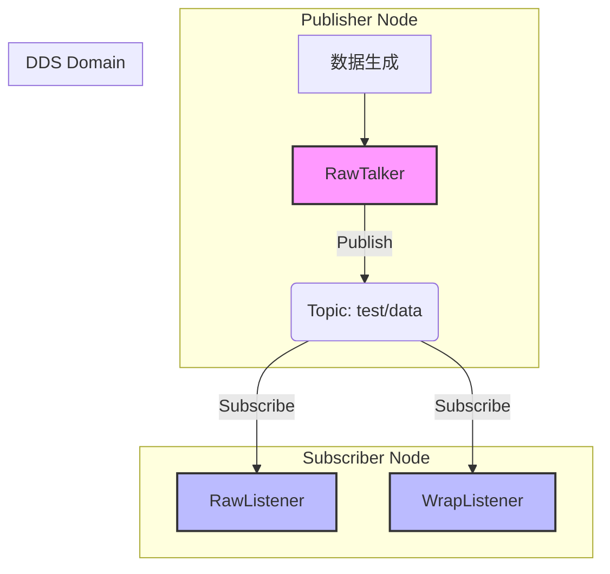

# CycloneDDS 性能测试基准

## 项目简介

本项目用于测试 **CycloneDDS** 中间件的性能表现，主要关注 **CPU 使用率** 和 **消息传输延迟** 两个关键指标。通过模拟机器人控制系统中的高频数据传输场景，评估 CycloneDDS 在嵌入式环境下的实时性能。

### 系统架构



### 技术特点

- **CycloneDDS C++ API**: 基于现代 C++ (ISO C++ DDS API) 开发
- **QoS 配置**: 采用 `TransientLocal` + `Reliable` 组合，确保数据可靠性
- **高频传输**: 支持高频率（如 1ms 周期）的消息发布
- **多种订阅模式**: 
  - `raw_listener`: 基于 WaitSet 的事件驱动模式
  - `wrap_listener`: 基于 Listener 的回调模式

### 测试场景

- **Publisher (`raw_talker`)**: 周期性发送 `TestFixedData` 消息（包含时间戳和大量填充数据）
- **Subscriber (`raw_listener`/`wrap_listener`)**: 接收消息并计算端到端延迟
- **消息内容**: 包含序列号、时间戳及固定大小的字节数组，模拟传感器或控制指令数据

## 测试结果分析

| 测试项                | 发布方 (CPU) | 订阅方 (CPU) | 平均延时 (Avg Delay) |
| :-------------------- | :----------- | :----------- | :------------------- |
| CycloneDDS (WaitSet)  | 待测试       | 待测试       | 待测试               |
| CycloneDDS (Listener) | 待测试       | 待测试       | 待测试               |

> 注：具体性能数据取决于硬件平台和网络环境。

## 目录结构

```
.
├── 3rd/                # 第三方库 (CycloneDDS, Iceoryx)
├── build.sh            # 构建脚本
├── CMakeLists.txt      # CMake 构建配置
├── src/                # 源代码
│   ├── raw_talker.cpp          # 发布者实现
│   ├── raw_listener.cpp        # 订阅者实现 (WaitSet)
│   └── wrap_reader_listener.cpp # 订阅者实现 (Listener)
├── msg/                # 消息定义
│   ├── test_data.idl   # IDL 定义
│   └── test_data.hpp   # 生成的 C++ 头文件
└── scripts/            # 辅助脚本
```

## 快速开始

### 1. 环境准备

#### 依赖要求
- Linux 系统 (支持 x86_64 和 aarch64)
- CMake 3.10+
- GCC 7+ 或 Clang 6+
- CycloneDDS (已包含在 `3rd` 目录，无需额外安装)

### 2. 编译构建

项目提供了便捷的构建脚本 `build.sh`。

```bash
# 克隆项目
git clone <repository-url>
cd dds_benchmark

# 构建项目 (默认 x86_64 Release)
./build.sh

# 或者指定架构和构建类型
./build.sh x86_64 Debug    # x86_64 调试版本
./build.sh aarch64 Release # aarch64 交叉编译版本
```

### 3. 运行测试

编译完成后，可执行文件位于 `build/deploy/bin` 目录。**注意：运行前必须指定 CycloneDDS 配置文件路径。**

**终端 1: 启动订阅者**
```bash
# 在项目根目录下执行
export CYCLONEDDS_URI=file://$(pwd)/config/cyclonedds.xml

cd build/deploy/bin
./raw_listener
# 或者使用回调模式的监听器
# ./wrap_listener
```

**终端 2: 启动发布者**
```bash
# 在项目根目录下执行
export CYCLONEDDS_URI=file://$(pwd)/config/cyclonedds.xml

cd build/deploy/bin
./raw_talker
```

### 4. 参数配置

可以通过修改源码中的宏定义来调整测试参数（需重新编译）：
- `TOPIC`: 修改 DDS Topic 名称 (默认 "test/data")
- 数据发送频率: 在 `raw_talker.cpp` 中调整定时器间隔
